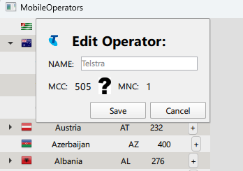

# Mobile Operators

## Overview

Mobile Operators is a Qt-based desktop application designed to display and manage a list of mobile network operators organized by their countries. The application allows users to view, add, edit, and delete operators through a modern user interface built with QML and QtQuick.

For updated version with added optimization techniques and current bugs fixed check branch *update* 

## Technologies Used

- C++17 — Core logic and data structures
- Qt 6.x — UI and application framework:
  - QtQuick / QML
  - QtSql
  - QtQuick.Controls
- SQLite — Embedded database storage
- CMake — Cross-platform build system

## Architecture

This project follows the MVVM (Model-View-ViewModel) pattern:
- Model:  
  `DataStorage` — Manages raw data and persistence using SQLite.
- ViewModel:  
  `CombinedModel` — Inherits from `QAbstractItemModel`, acts as a data bridge between the UI and the backend logic.
- View:  
  QML UI components — Implements interactive UI with TreeView, Dialogs, and reusable components.

## Features

- View a hierarchical list of countries and their mobile operators using TreeView.
- Add new mobile operators to a country.
- Edit the name of any existing operator.
- Delete an operator from both the interface and the database.
- Display operator and country images.
- Filtering by country name (future extension).

## Showcase



## Build 
- Install Qt 6.x and CMake (3.16 or newer)
- Clone the repository:
```
    git clone https://github.com/letsexisttogether/MobileOperators
    cd MobileOperators
```
- Configure CMake and build:
```
mkdir build && cd build
cmake ..
cmake --build .
```